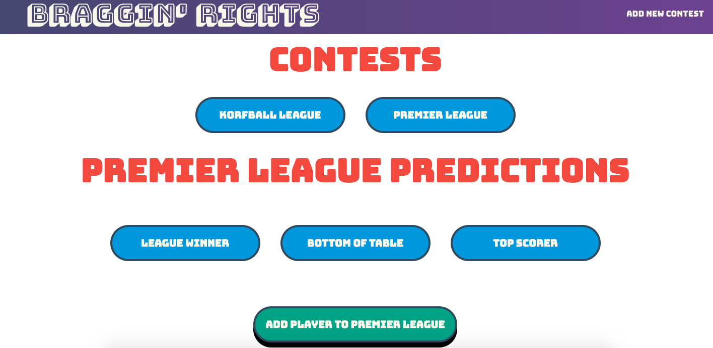
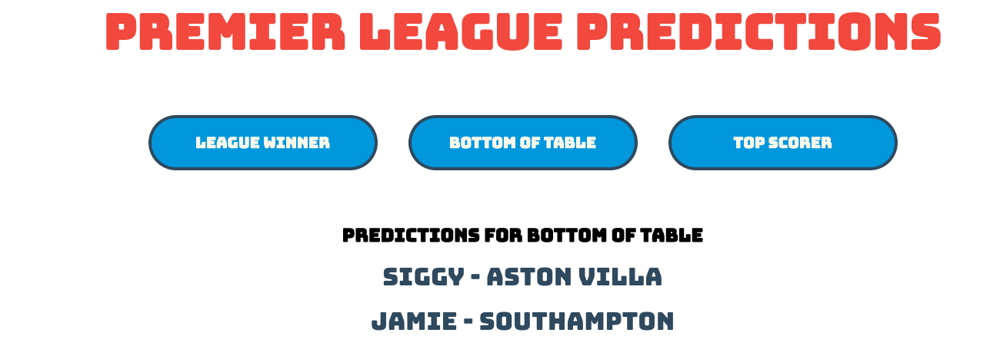
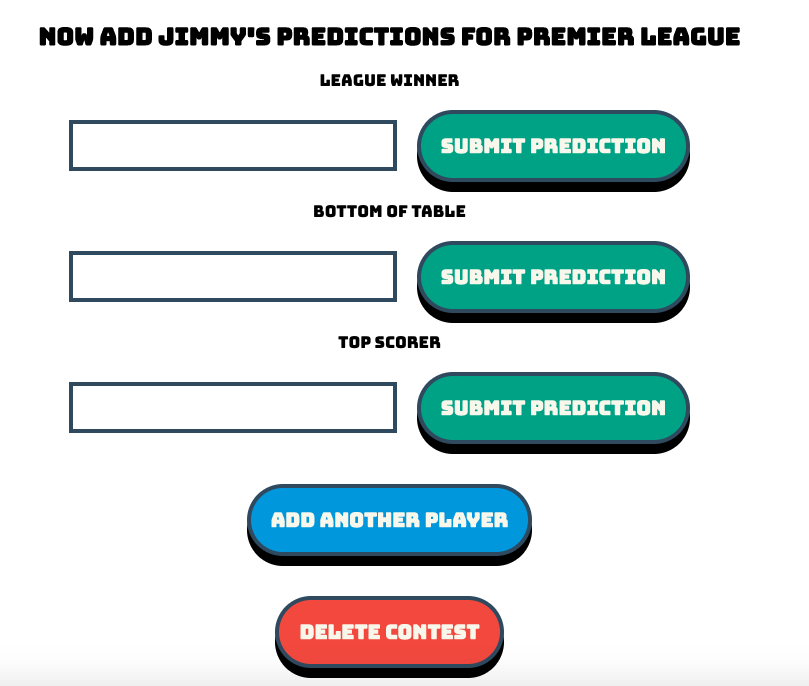

# Braggin-Rights

This is the final project I did at CodeClan, I have done a fair amount of refactoring since the project finshed as I really enjoy working with React.

This is the front page of the app

The player's predictions are displayed as can be seen here.

This is the functionality which allows the user to add a player's predictions

## Brief

Braggin rights enables groups of friends to make predictions on the outcome of any sporting / cultural event.  The user aka  'the game-master' should be able to add a contest (ie Premier League), guessables which the group would like to predict (ie Top scorer, Top of league) and the predictions themselves.  The app saves these predictions which allows the game-master to see who was right / wrong, thus they get braggin rights!

## Tech

- Java / Spring

– Javascript / React

## How to Setup this Project

Please note that this readme assumes knowledge of git.

1. Git Clone the project and save it onto your desktop.

2. Open the back end folder in IntelliJ IDEA CE and get it running. 

To do this navigate to... src > main > java > com.codeclan > BragginRightsApplication
Now run public static void main by clicking on the green arrow to the left of the code. 

This will run the back end and you should see Spring booting into action, it should say that the server is now running.  

3. Navigate to the front end directory in terminal. 

4. Run a NPM install, this should find your package json in the front end directory and install all the dependencies. 

5. Once these are installed go back to terminal and type in 'npm start', again in the front end folder.  This should bring up a window in your browser on Localhost:3000.

The web app should be up and running!
